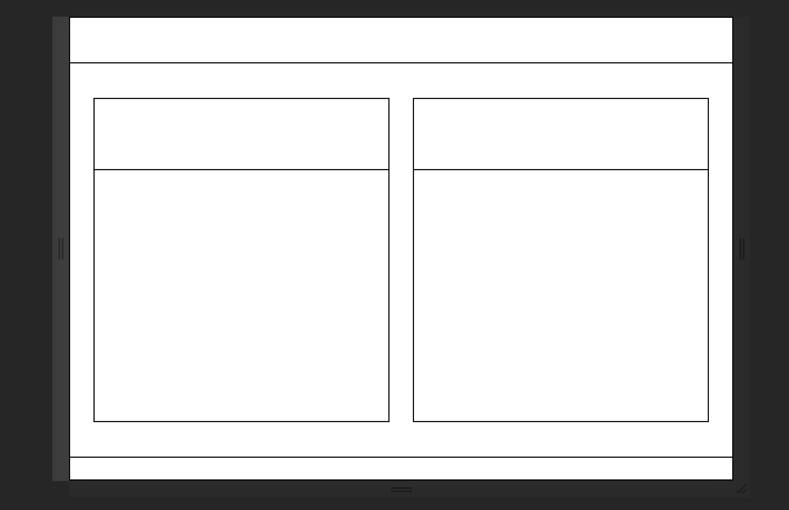
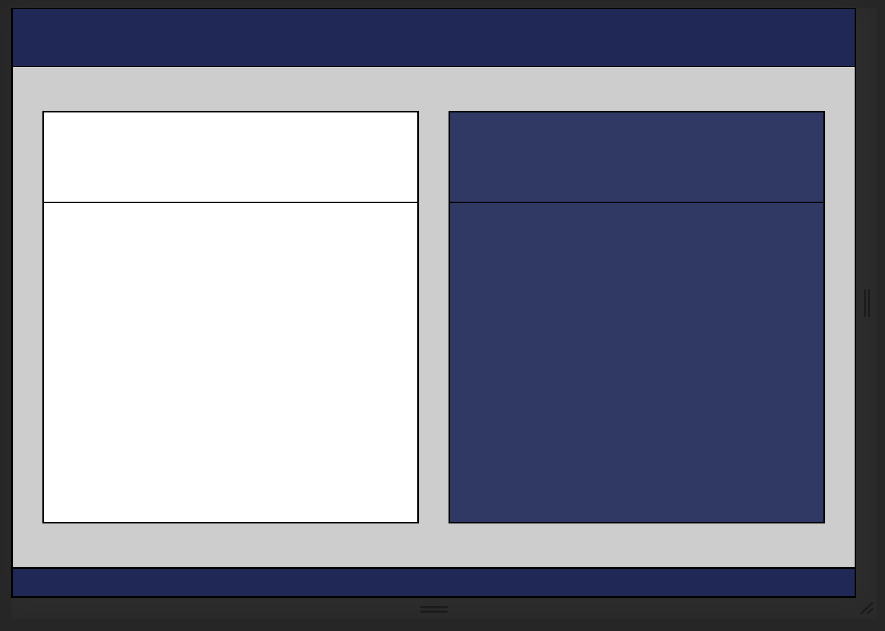
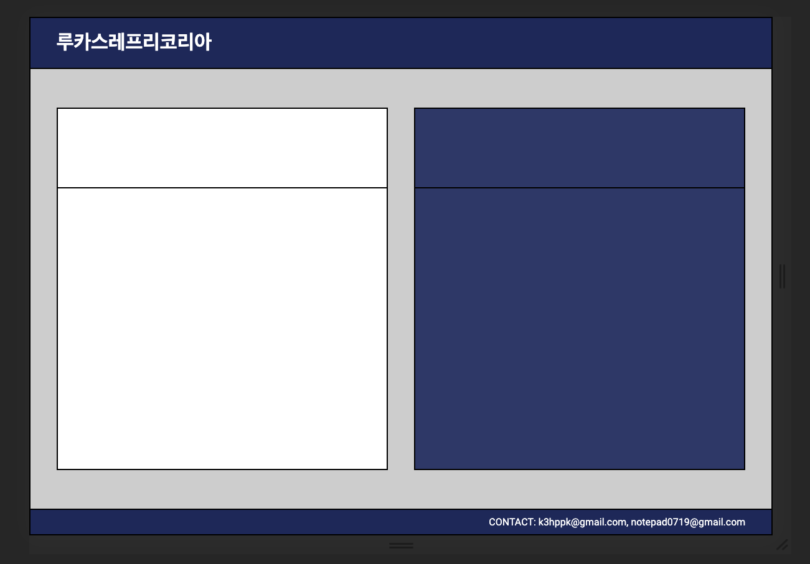
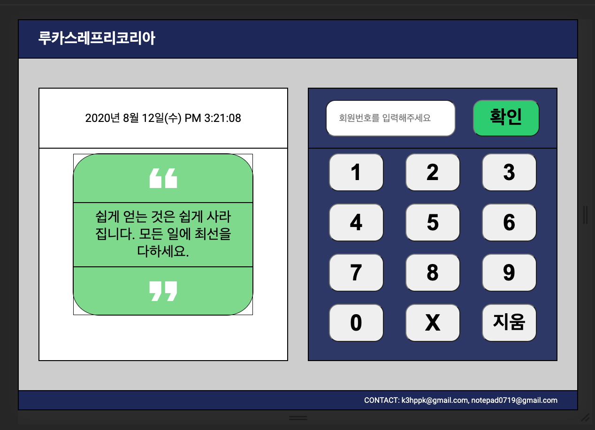
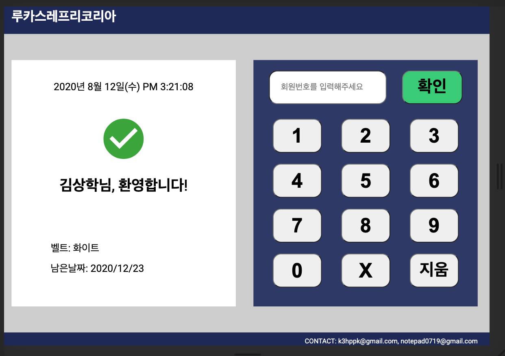

## 루카스 레프리 코리아 출석체크 웹사이트

## 08/12

오븐으로 프로토 타이핑을 마치고, 개발을 하는데 있어 엄청 힘이 들었다. 이유에는 아마 두 가지가 있을 것이다. 

1. 나의 부족한 css 구현 실력
2. 픽셀 등을 신경쓰지 않은 프로토타이핑

두 가지 요인이 복합적이지만, 내가 오늘 html/css로 구현을 하는데 있어 가장 힘들었던 점은 프로토타이핑이 정확하게 되지 않아 css를 무엇을 찾아봐야 할 지 몰랐다는게 더욱 더 힘이 들었다. 그래서, 다른 프로토타이핑 툴을 이용해 다시 해보려 한다.

### 와이어프레이밍
- [balsamiq](https://balsamiq.com/)

### 프로토타이핑

- [Figma](https://www.figma.com/)

이것을 사람들이 많이 사용하는 지 모르겠다. 한 번 살펴보자.
그리고 무엇보다도, 여기에 사용할 시간을 플랜하고, 그대로 움직여보자

## 08/17

8월 19일까지, 출석체크 전 후 페이지를 완성시키기로 하였다. 너무 늦어지기 전에 빨리 시간을 투자하여야 할 것 같다. 8월 12일의 기록들을 보면, 이미 프로토타이핑을 [오븐](https://ovenapp.io/project/3mqjAEjPKg8GQls4n7bevBfEvOfuxxqi/#uIo6w)으로 하였지만 실제 아이패드의 비율에 맞추지 않고 작업을 하여 실제 작업을 함에 있어 흐트러짐이 있었다고 볼 수 있다. 그래서, 실제 코드 작업을 하기 전, 아이패드 비율에 맞춰 3가지 프로세스를 거쳐보고자 한다.

- 연필 스케치
- 와이어프레이밍([balsamiq](https://balsamiq.com/))
- 프로토타이핑([Figma](https://www.figma.com/))

### 연필 스케치

가장 먼저 연필 스케치를 통해서, 전반적인 아이디어와 구상을 해본다.

### 와이어프레이밍(Wireframing)

연필 스케치를 통해서 완성된 구상을, 아주 간단하게 비율에 맞춰서 작업을 해본다. 완벽하지는 않지만 전체적인 구상을 디지털로 볼 수 있게 된다.

### 프로토타이핑(Prototyping)

마지막으로, 전체적으로 구상된 것을, 색깔 등 전체적인 마무리를 끝내어, 우리의 마지막 결과물이 어떻게 생길지 정확하게 구현해낸다.

이 3가지 프로세스를 모든 거친 다음에는, 코드 작업을 시작할 것이다.

## 연필 스케치

#### 출석체크 전

#### 출석체크 후

아직 연필로만 해서, 잘 느낌이 안난다.

## 발사믹

#### 출석체크 전

#### 출석체크 후

음... 대충 가이드가 보이긴 하는데, 무언가 조금 아쉽다 디자인이. 하지만 일단 지금의 목적은 먼저 만드는 게 목적이지 처음부터 완벽하게 하려하면 안되겠지. 일단 만들어두고 계속 검사맡으면서 고쳐나가자.

## 피그마

[Brad Traversy X Dev ed Figma](https://www.youtube.com/watch?v=4W4LvJnNegA)를 다 봤다. 일단 오븐이랑 크게 다른 것은 없어보이고, 일단 어떻게보면 오븐이 더 나은거 같기도 하다. 일단 피그마를 봤으니 피그마를 써봐야 겠다.

## 08/18

오늘은 두 가지를 해보려 한다.

- 프로토타이핑 - 피그마
- 코드작업 시작

### 프로토타이핑(피그마)

어제 피그마 튜토리얼을 대충 보았다. 그래도 일단 써본다는 것에 의의를 두고, 프로젝트와 가깝게, 와이어프레이밍을 해둔 작품을 참고하면서 작업을 시작해야겠다.

#### 출석체크 전

#### 출석체크 후

피그마 작업을 끝을 냈다. 이렇게 작업을 하고 보니 무엇인가 조금 신기하다. 나에게는 마지막 작업을 이렇게 끝을 내야 무엇인가 마지막 결과물이 어떻게 생길지 정확하게 알게됨으로써 코드를 짤 때 조금 더 명확하게 짤 수 있을 것 같다.

코드 작업을 시작할 차례이다.

## 08/19

### 코드시작

코드 작업을 시작하기 전에 궁금한 것이 있다. 보통 html css 작업을 할 때 일반적인 흐름도가 궁금하다. 나는 항상, 코드를 짤 때 큰 그림을 보지 못하고 작은 그림에 너무 얽매여 코드를 짜는 시간이 길어지는 현상이 발생할 때가 많은 것 같다. 한 번 효율적인 workflow가 있는지 찾아보아야 겠다.

1. 일반적인 html css 작업흐름도(worfklow)

The Odin Project 디스코드에 질문을 한 결과, 보통 HTML과 아주 최소한의 스타일링을 짜고, 어떤 식으로 생긴지 보면서 디테일에 집중은 나중에 한다고 한다. 나도 아마 똑같이 하여야 할 것 같다. 일단 누구에게나 작업흐름도가 다를 수 있으니 최선의 방법을 찾기 위해선 여러 방법을 시도 해보아야겠다. 이번에는 가장 먼저 할 것은 아주 큰 레이아웃을 테두리선만 따서 만들어야 겠다. 이것은 `flex`를 써서 만들 예정이다.

1. 큰 레이아웃 만들기

플렉스박스로 대충의 레이아웃은 만들었다. 이제 칼라를 넣어주자.

2. 색깔입히기(coloring)

3. 헤더, 푸터 작업

그 다음은 가장 쉬운 헤더와 푸터 작업을 해주어야겠다. 가장 어려운 메인은 뒤로 약간 미루어 두어야지.

4. 왼쪽 박스, 오른쪽 박스 채워넣기

이제 가장 기본적인 것들은 하였으니, 왼쪽 박스와 오른쪽 박스를 채워 넣어주어야 겠다.

- 왼쪽박스

    - 날짜
    - 인용구

- 오른쪽박스

    - 회원번호 입력 인풋
    - 확인 버튼
    - 숫자 버튼들(그리드)

왼쪽박스부터 시작하여보자.

비슷하게 된 것 같다. 인용구문이 약간 좀 촌스럽긴하다. 그리고 인용 기호 옆에 줄을 넣어주어야 되는데, 지금은 시간이 없으니 일단 확인 버튼을 누른 후의 화면을 만들어주어야겠다.

## 08/20

### 오늘의 할 일:

- login-before 화면 왼쪽 박스 새로 디자인 후 코드 작업
- 버튼을 눌렀을 때
    - 아웃라인 없애기
    - 약간 눌리는 이펙트 넣기
- 인풋을 클릭했을 때
    - 아웃라인 없애기

### REVIEW

작업시간: 2 포모도로
- 18:18~18:43
- 18:48~19:13

오늘의 할 일은 대충 끝냈다. 그리고 login-before 화면 왼쪽 박스 새로운 디자인은, 일단 지금 잘 떠오르지 않기 때문에, 기능에 먼저 집중하기로 했다. 다음 번에는, 이제 임의로 회원전화번호를 한 번 만들어서, 실제 번호가 매칭 되었을 때, 환영한다는 문구를 띄워주는 기능을 구현시킬 것이다.

## 08/21

### 할 일

- 번호가 눌릴때, 그 번호를 회원번호 입력칸에 집어넣어주기
- 회원 오브젝트를 만들어, 그 사람의 번호와 매칭이 된다면, 그 사람의 이름을 출력시켜보자

### REVIEW

작업시간 
    - 22:51~23:16

오늘 한 일
- 번호가 눌릴때, 그 번호를 회원번호 입력칸에 집어넣어줌

다음에 할 일
- 회원 오브젝트를 만들어 그 사람의 번호와 매칭이 되면 그 사람의 이름을 출력. 마지막으로는 유저라는 데이터베이스가 있고 내가 거기서 읽어와야겠지.

## 08/27

### 오늘의 할 일

- 회원 오브젝트를 만들어, 그사람의 번호와 매칭이 되면 그 사람의 이름을 출력하며, 환영창을 띄운다
    - ~~회원 오브젝트엔 무엇이 들어가는가?~~
    - ~~확인을 눌렀을시, input에 있는 번호를 어떻게 넘길 것인가?~~
    - 회원이 입력한 값을 어떻게 학생들의 전화목록과 비교할 것인가?

### TODAY REVIEW

오늘 회원 출석 기능을 구현하고 있다. 조금씩 다 되어간다. 얼마 안 걸려 완성할 듯 싶다.

- 작업시간: 16:30~18:53(4 포모도로)

## 08/28

### 할 일

- 회원이 입력한 값을 어떻게 학생들의 전화목록과 비교할 것인가?
    - ~~전화번호 목록은 어디에 어떤식으로 저장되어 있고 당신이 거기에 접근할 수 있는가?~~
    - ~~임의의 번호를 넘겨주면, 그 번호가 전화번호 목록에 있는지 확인할 수 있는가?~~
    - 회원이 입력한 값은 display.js가 확인한다. 회원의 전화번호 목록을 검색하는 것은 student.js에서 한다. 그렇다면, **display.js에서 회원이 입력한 값을 어떻게 student.js로 넘겨주어서 전화번호 목록을 검색시키나?**
        - module을 쓴다. [module 설명이 잘 되어있는 사이트](https://javascript.info/modules-intro)

## 08/31

### 할 일

- 넘겨준 번호가 존재할 시, 환영문구창을 띄어주어야 한다. 어떻게 할까?
    - ~~넘겨준 번호를 체크할 수 있는가?~~
    > 반복문을 통해, students 배열에 들어있는 학생들의 개체에서 번호를 검색해나간다
    - ~~그 사람의 이름을 알아낼 수 있는가?~~
    > 알아낼 수 있다. 각각의 반복에서, 어떤 번호가 넘겨준 번호와 일치한다면, 나는 그 객체의 `name` 속성을 반환해주면 된다.
    - 환영문구창에 그 사람의 이름을 어떻게 넣어줄 것인가?
    > 어떻게 띄우지???

### 오늘의 작업 리뷰

- 작업시간: 13:30~15:30(4 pomodoro)
- 오늘 기본적으로 끝번호 4자리를 넘겨주었을 시 확인을 하는 논리를 만들었다. 그것은 쉽게 만들었다. 하지만 문제가 되는 게 무엇이였냐 하면은, 내가 그 사람의 이름을 환영창에 띄워줘야 하는데, 여기서 내가 잘 못하고 있는 것이
    - 어떻게 HTML 내용물을 바꾸어 줄것인지?
    > 일단 JS로 하는 중
    - 바뀌었을 때 CSS는 어떻게 또 적용시켜 줄 것인지?
    > 모르겠다. 여러개의 다른 파일을 만들어야 하나? 아니면 한 개의 파일에서 모든 것을 해야하나?

대충 그렇다. 일단 학생 객체에, 더 필요한 속성(벨트, 남은날짜 등등)을 넣어준다음 다시 작업을 시작해보아야 겠다.

## 09/01

### 오늘의 할 일과 목표

나는 모든 것을 만들때 OOP 원칙의 기본, Single Responsibility Principle을 생각할 것이다. 체크 하여야 할 것은, 니가 만드는 함수, 클래스, 객체 등이 한 가지 이유만을 위해 존재하냐는 것이다.

- 혹시나 여러 개의 일을 하고 있지는 않은가?
- 조금 더 작은 함수 등으로 나누어질 수 있는가?

등등을 확인해보자.

그리고 오늘의 **할 일**은

- 모든 속성을 추가한 학생 객체를 만들어라

### TODAY REVIEW

- 작업시간
> 13:30~15:30 (3 pomodoro)

- 내일 해야 할 일
> 모든 속성을 추가한 학생 객체 만들기 - 속성마다 set,get함수 다 만들어주기

## 09/02

### TODAY REVIEW

[회원을 등록하는 페이지](https://www.figma.com/file/VvXHGyKhj05vyZ3jMG4tS9/lucaslepriGym?node-id=24%3A92)를 만들었다

이제 내가 하여야 할 것은, 이것을 통해 등록을 할 때 Student 모듈과 연결시켜, 새로운 학생을 생성해주는 것이다.

먼저 하여야 할 것은
- HTML로 회원등록 페이지를 만들자.

