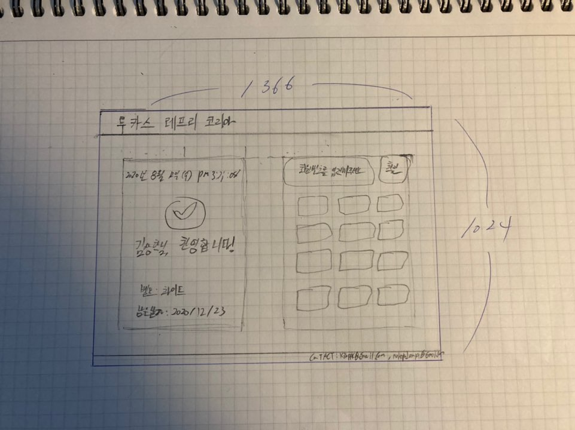
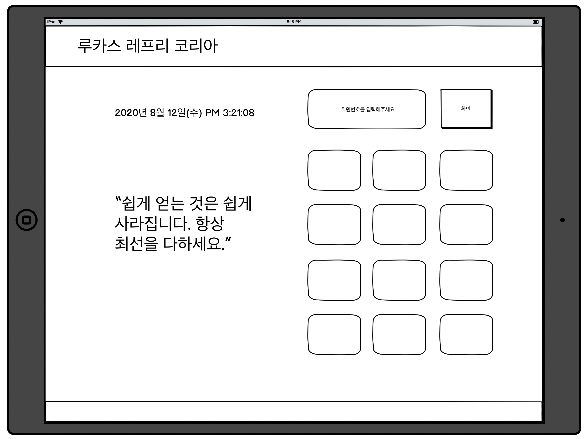
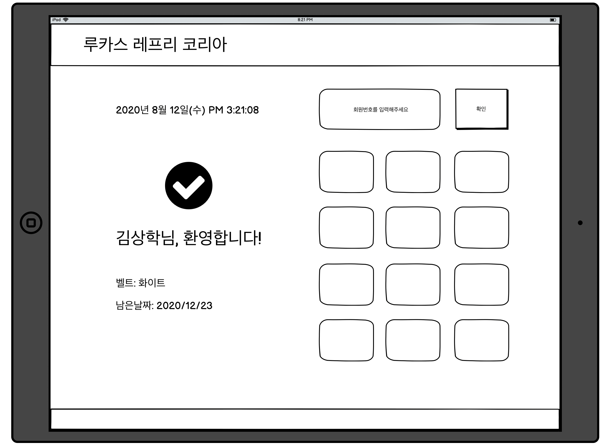
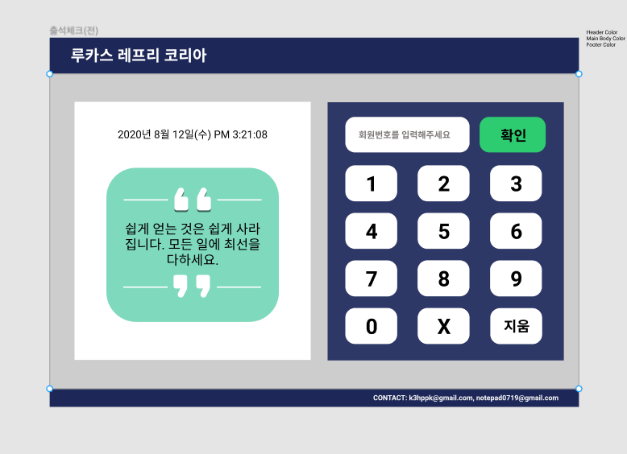
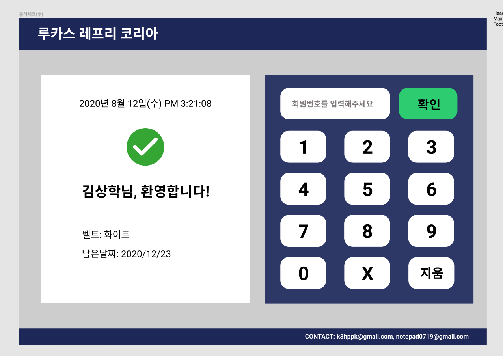

## 루카스 레프리 코리아 출석체크 웹사이트

## 08/12

오븐으로 프로토 타이핑을 마치고, 개발을 하는데 있어 엄청 힘이 들었다. 이유에는 아마 두 가지가 있을 것이다. 

1. 나의 부족한 css 구현 실력
2. 픽셀 등을 신경쓰지 않은 프로토타이핑

두 가지 요인이 복합적이지만, 내가 오늘 html/css로 구현을 하는데 있어 가장 힘들었던 점은 프로토타이핑이 정확하게 되지 않아 css를 무엇을 찾아봐야 할 지 몰랐다는게 더욱 더 힘이 들었다. 그래서, 다른 프로토타이핑 툴을 이용해 다시 해보려 한다.

### 와이어프레이밍
- [balsamiq](https://balsamiq.com/)

### 프로토타이핑

- [Figma](https://www.figma.com/)

이것을 사람들이 많이 사용하는 지 모르겠다. 한 번 살펴보자.
그리고 무엇보다도, 여기에 사용할 시간을 플랜하고, 그대로 움직여보자

## 08/17

8월 19일까지, 출석체크 전 후 페이지를 완성시키기로 하였다. 너무 늦어지기 전에 빨리 시간을 투자하여야 할 것 같다. 8월 12일의 기록들을 보면, 이미 프로토타이핑을 [오븐](https://ovenapp.io/project/3mqjAEjPKg8GQls4n7bevBfEvOfuxxqi/#uIo6w)으로 하였지만 실제 아이패드의 비율에 맞추지 않고 작업을 하여 실제 작업을 함에 있어 흐트러짐이 있었다고 볼 수 있다. 그래서, 실제 코드 작업을 하기 전, 아이패드 비율에 맞춰 3가지 프로세스를 거쳐보고자 한다.

- 연필 스케치
- 와이어프레이밍([balsamiq](https://balsamiq.com/))
- 프로토타이핑([Figma](https://www.figma.com/))

### 연필 스케치

가장 먼저 연필 스케치를 통해서, 전반적인 아이디어와 구상을 해본다.

### 와이어프레이밍(Wireframing)

연필 스케치를 통해서 완성된 구상을, 아주 간단하게 비율에 맞춰서 작업을 해본다. 완벽하지는 않지만 전체적인 구상을 디지털로 볼 수 있게 된다.

### 프로토타이핑(Prototyping)

마지막으로, 전체적으로 구상된 것을, 색깔 등 전체적인 마무리를 끝내어, 우리의 마지막 결과물이 어떻게 생길지 정확하게 구현해낸다.

이 3가지 프로세스를 모든 거친 다음에는, 코드 작업을 시작할 것이다.

## 연필 스케치

#### 출석체크 전

#### 출석체크 후

아직 연필로만 해서, 잘 느낌이 안난다.

## 발사믹

#### 출석체크 전

#### 출석체크 후

음... 대충 가이드가 보이긴 하는데, 무언가 조금 아쉽다 디자인이. 하지만 일단 지금의 목적은 먼저 만드는 게 목적이지 처음부터 완벽하게 하려하면 안되겠지. 일단 만들어두고 계속 검사맡으면서 고쳐나가자.

## 피그마

[Brad Traversy X Dev ed Figma](https://www.youtube.com/watch?v=4W4LvJnNegA)를 다 봤다. 일단 오븐이랑 크게 다른 것은 없어보이고, 일단 어떻게보면 오븐이 더 나은거 같기도 하다. 일단 피그마를 봤으니 피그마를 써봐야 겠다.

## 08/18

오늘은 두 가지를 해보려 한다.

- 프로토타이핑 - 피그마
- 코드작업 시작

### 프로토타이핑(피그마)

어제 피그마 튜토리얼을 대충 보았다. 그래도 일단 써본다는 것에 의의를 두고, 프로젝트와 가깝게, 와이어프레이밍을 해둔 작품을 참고하면서 작업을 시작해야겠다.

#### 출석체크 전

#### 출석체크 후

피그마 작업을 끝을 냈다. 이렇게 작업을 하고 보니 무엇인가 조금 신기하다. 나에게는 마지막 작업을 이렇게 끝을 내야 무엇인가 마지막 결과물이 어떻게 생길지 정확하게 알게됨으로써 코드를 짤 때 조금 더 명확하게 짤 수 있을 것 같다.

코드 작업을 시작할 차례이다.

### 코드시작

코드 작업을 시작하기 전에 궁금한 것이 있다. 보통 html css 작업을 할 때 일반적인 흐름도가 궁금하다. 나는 항상, 코드를 짤 때 큰 그림을 보지 못하고 작은 그림에 너무 얽매여 코드를 짜는 시간이 길어지는 현상이 발생할 때가 많은 것 같다. 한 번 효율적인 workflow가 있는지 찾아보아야 겠다.